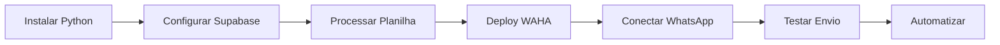

# 🚀 BEM-VINDO AO SISTEMA DE REATIVAÇÃO VIA WHATSAPP

Sistema completo para reativar alunos inativos usando WhatsApp automatizado.

**💰 Custo: R$ 0/mês** (tiers gratuitos)
**⏱️ Setup: 10 minutos**
**📱 WhatsApp: API Oficial**

---

## 🎯 O QUE ESTE SISTEMA FAZ?

1. ✅ Processa planilha de alunos inativos (Excel)
2. ✅ Envia mensagens personalizadas via WhatsApp
3. ✅ Rastreia consentimento LGPD automaticamente
4. ✅ Registra todos envios (auditoria completa)
5. ✅ Automatiza envio diário (30 leads/dia)
6. ✅ Dashboard de métricas em tempo real

---

## 📋 PRÉ-REQUISITOS

Antes de começar, você precisa ter:

### **Contas Online (Grátis)**
- [ ] Conta no Supabase (https://supabase.com) ✅ Já criada: `eiqzckhcmmfyddruaxdj`
- [ ] Conta no Railway (https://railway.app) - Login via GitHub
- [ ] WhatsApp Business ou Pessoal

### **Software Local**
- [ ] Python 3.8 ou superior → [Baixar aqui](https://www.python.org/downloads/)
- [ ] Git (opcional) → [Baixar aqui](https://git-scm.com/downloads)

### **Dados**
- [ ] Planilha de alunos inativos (.xlsx) ✅ Já tem: `C:\Users\User\Downloads\AlunosInativos.xlsx`

---

## 🚦 ESCOLHA SEU CAMINHO

### **🟢 Opção 1: INICIANTE (Passo-a-Passo Detalhado)**

**Melhor para:** Primeira vez usando este tipo de sistema

📖 **Siga este guia:**
```
C:\Users\User\waha-n8n-stack\GUIA_MVP_5MIN.md
```

Você terá:
- ✅ Explicação detalhada de cada passo
- ✅ Screenshots e exemplos visuais
- ✅ Verificação após cada etapa
- ✅ Troubleshooting integrado

---

### **🟡 Opção 2: EXPERIENTE (Checklist Rápido)**

**Melhor para:** Você já trabalha com Python, APIs e bancos de dados

⚡ **Execute este checklist:**
```
C:\Users\User\waha-n8n-stack\QUICKSTART.md
```

Você terá:
- ✅ Comandos diretos para copiar/colar
- ✅ Checklist com ☑️ marcáveis
- ✅ Troubleshooting em tabela
- ✅ Setup em ~5 minutos

---

### **🔵 Opção 3: AUTOMÁTICO (Script de Setup)**

**Melhor para:** Quer começar o mais rápido possível

🤖 **Execute este script:**
```cmd
cd C:\Users\User\waha-n8n-stack\scripts
setup_completo.bat
```

O script fará:
- ✅ Instalação de dependências Python
- ✅ Criação do arquivo .env
- ✅ Verificação da planilha
- ✅ Guia interativo dos próximos passos

---

## 📂 ESTRUTURA DO PROJETO

```
waha-n8n-stack/
│
├── 📄 COMECE_AQUI.md          ← VOCÊ ESTÁ AQUI
├── 📄 GUIA_MVP_5MIN.md        ← Tutorial completo
├── 📄 QUICKSTART.md           ← Checklist rápido
├── 📄 README.md               ← Documentação técnica
│
├── 📁 supabase/
│   └── schema.sql             ← Banco de dados
│
├── 📁 scripts/
│   ├── processar_inativos.py  ← Processa Excel
│   ├── enviar_diario.py       ← Envia WhatsApp
│   ├── executar_envio.bat     ← Atalho Windows
│   └── setup_completo.bat     ← Setup automático
│
├── 📁 ops/
│   └── .env.sample            ← Configurações
│
└── 📁 infra/
    └── railway.waha.Dockerfile ← Deploy WAHA
```

---

## 🎯 RESUMO DO FLUXO DE SETUP



**Passo-a-passo:**

1️⃣ **Instalar Python + Dependências** (2 min)
2️⃣ **Configurar Banco Supabase** (2 min)
3️⃣ **Processar Planilha Excel** (1 min)
4️⃣ **Deploy WAHA no Railway** (3 min)
5️⃣ **Conectar WhatsApp (QR Code)** (1 min)
6️⃣ **Testar Primeiro Envio** (1 min)
7️⃣ **Automatizar Envios Diários** (1 min)

**⏱️ TOTAL: ~10 minutos**

---

## 💡 DICA RÁPIDA

Se quiser apenas **VER COMO FUNCIONA** antes de instalar:

1. Abra o arquivo: `scripts/enviar_diario.py`
2. Leia os comentários explicativos
3. Veja a lógica de envio em ~200 linhas de código Python simples

---

## ❓ DÚVIDAS FREQUENTES

### **Preciso pagar alguma coisa?**

Não! Usando os tiers gratuitos:
- Supabase Free: 500 MB DB (suficiente para 1000+ leads)
- Railway Free: 500h/mês ($5/mês se passar)
- WAHA: Open Source gratuito
- WhatsApp: Seu número pessoal/business

**Total: R$ 0/mês para MVP com 30 leads/dia**

### **É seguro para minha conta do WhatsApp?**

Sim! O WAHA usa a API oficial do WhatsApp Web (mesmo protocolo do navegador).

**Recomendações:**
- ✅ Use WhatsApp Business se possível
- ✅ Não ultrapasse 30 mensagens/dia no início
- ✅ Personalize as mensagens (evite spam)
- ✅ Tenha consentimento LGPD dos leads

### **Quanto tempo leva para reativar alunos?**

Baseado em campanhas similares:
- **Dia 1-3:** ~10-15% respondem
- **Semana 1:** ~20-25% respondem
- **Semana 2-4:** ~5-10% convertem (matrículas)

**Exemplo com 30 leads:**
- 6-8 respostas esperadas
- 2-3 matrículas potenciais

### **E se algo der errado?**

Todos os guias incluem seção de **Troubleshooting**:
- `GUIA_MVP_5MIN.md` - Seção 9
- `QUICKSTART.md` - Tabela de erros comuns
- `README.md` - FAQ completo

Logs detalhados ficam salvos em `whatsapp_envios` (Supabase).

---

## 🔐 CONFORMIDADE LGPD

O sistema está **100% conforme** com a Lei Geral de Proteção de Dados:

- ✅ Rastreamento de consentimento explícito
- ✅ Direito ao opt-out automático
- ✅ Auditoria completa de operações
- ✅ Retenção controlada de dados
- ✅ Minimização de dados coletados

**Detalhes:** `SECURITY_LGPD.md`

---

## 📞 PRÓXIMO PASSO

**🎯 Escolha sua opção acima e comece!**

Recomendo começar pela **Opção 1** (Passo-a-Passo) se for sua primeira vez.

### **Abrir Guia Detalhado:**

```cmd
notepad C:\Users\User\waha-n8n-stack\GUIA_MVP_5MIN.md
```

Ou use qualquer editor de texto (VS Code, Sublime, etc.).

---

## 📚 DOCUMENTAÇÃO ADICIONAL

- **`README.md`** - Documentação técnica completa
- **`SECURITY_LGPD.md`** - Conformidade legal
- **`ASSUNCOES.md`** - Decisões de arquitetura
- **`ops/README_deploy.md`** - Deploy em produção
- **`scripts/README.md`** - Documentação dos scripts

---

**🎉 Boa sorte com a reativação dos seus alunos!**

Se tiver dúvidas durante o processo, consulte o troubleshooting nos guias.

---

*Última atualização: 2025-10-03*
